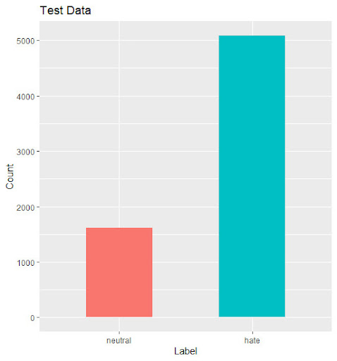
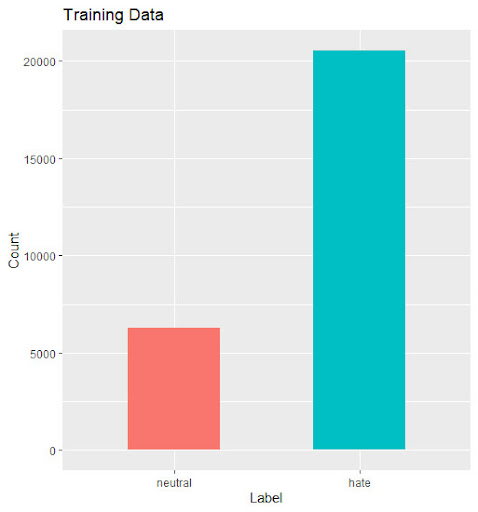
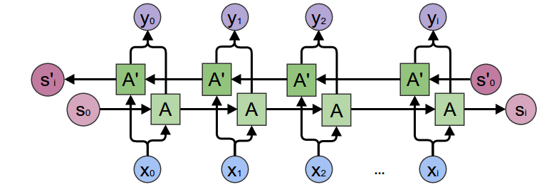

# Hatespeech

This project develops a model for binary classification on hate speech sentences. To accomplish this I am using the 
BILSTM (Bidirectional Long Short Term Memory) language model.

## Dataset

Dataset can be found here in the data directory. 
There are in total 36626 observations with 27732, 1923 and 6971 instances for training, validation and testing respectively. 

Sample for the training Dataset:

text |	label 
----- | ------
caucasians wearing masks to prevent coronavirus and still don t wash their hands | No Hate
You and yuh bitch ass ull get smacked quick | Hate
Theres a girl in your avi, you must get so many bitches | Hate
King, TI vs tip and that troubleman albums all trash | No Hate
nigger faggot retard beaner dishwasher time to see if i get ban | Hate
why don t white boys with curly hair comb it looks like a bird nest | No Hate





### Data Collection:

We collected data from various sources.

### 1- Hatxplain

we began with [Hatxplain](https://huggingface.co/datasets/viewer/?dataset=hatexplain) dataset which contained a total of sentences of 15383, 1923 and 1924 instances for training, validation and testing respectively that were collected from tweets and GAB posts.

In this dataset there was three classes Hate, Offensive and Neutral, for our binary classification purposes we collapsed the offensive and the hate labels together. And each sentence was annotated from three individuals. So we also had to get a majority vote from the three annotators.

We did also some basic preprocessing by removing special characters, removing emojies and toknization

### 2- Crawled neutral tweets

After testing our model with the hatexplain dataset we noticed that the accuracy of detecting hatespeech was very good however the model performed not as good in detecting neutral language.

So we tried to add some more neutral senctences, which we crawled from tweeter. These were about 900 Tweets that we labeld manually


### 3- Kaggle

Although we added some neutral sentences to the training set, we still had the same problem. We detected the problem to be that the hatexplain test dataset had a lot of mislabeled senctences. So we looked for another source which was the [Kaggle dataset](https://www.kaggle.com/mrmorj/hate-speech-and-offensive-language-dataset)

Labels: hate-speech, offensive language, and neither

Each sentence in the dataset was manually labeled by a minimum of 3 CrowdFlower users.
Class label was determined by the majority of CF users

We also had to collapse the hate-speech and offensive labels together for our binary classifier.

It contains 25296 entries, so we added them to our training dataset and then splited it into trianing 80% and testing 20 %

## Bilstem Model

Bidirectional LSTMs train two instead of one LSTMs on the input sequence. The first on the input sequence as-is and the second on a reversed copy of the input sequence. This can provide additional context to the network and result in faster and even fuller learning on the problem.




We used a Bilstm with the following hyperparameters:

epochs : 5

learning rate: 0.001

hidden dimension : 128

batch size : 128

sentence maximum length: 280

### Result

label |	precision | recall | f1 
----- | --------- | ------ | ----
Neutral | 0.74 | 0.80 | 0.77
Hate | 0.95 | 0.93 | 0.94
Overall accuracy | | | 0.90

### Thresolding

We also tried to test the model with threshold so only the predicted labels with certain confidence threshold will be compared with the true labels to get the results, if the model is not confident enough the sentence will not be taken into considration

#### 60% Threshold

label |	precision | recall | f1 
----- | --------- | ------ | ----
Neutral | 0.77 | 0.78 | 0.78
Hate | 0.95 | 0.94 | 0.95 
Overall accuracy | | | 0.91

#### 65% Threshold

label |	precision | recall | f1 
----- | --------- | ------ | ----
Neutral | 0.81 | 0.77 | 0.79
Hate | 0.95 | 0.96 | 0.96
Overall accuracy | | | 0.93

#### 70% Threshold

label |	precision | recall | f1 
----- | --------- | ------ | ----
Neutral | 0.83 | 0.68 | 0.75
Hate | 0.94 | 0.97 | 0.95
Overall accuracy | | | 0.92


## Install requirement:

  - Install peotry `pip install --user poetry`
  - navigate to the folder of the repo
  - Install requirements `poetry install`

## Run classifier:

The hyperparameters can be found in ./parser.py.

To train the model run `poetry run python main.py` in the terminal


## Prediction API

The model has a small API for prediction. To run the server execute `uvicorn main:app --reload` in the terminal

To get predictions you send a POST request to endpoint:

You can pass up to 10 sentences at a time (you can send more but the API will take only the first 5). POST request 
example:

```bash
curl -X POST "http://127.0.0.1:8000/model/predict?embeddings=true" \
    -H  "accept: application/json" \
    -H  "Content-Type: application/json" \
    -d "{\"sentences\":
            [\"Don't bother with black culture , it 's not worth the effort .\",
             \"Good going libtards , you ruined Rhodesia .\", 
             \"I would n't marry a asian even after cirurgy .\"]
        }"
```

Predictions at index 0 represent the ***NoHate*** class; index 1 represent ***Hate*** class.  Output example:

```bash
{
  "predictions": [
    [
      0.44551581144332886,
      0.5544842481613159
    ],
    [
      0.44643911719322205,
      0.5535609126091003
    ],
    [
      0.47761672735214233,
      0.5223833322525024
    ]
  ],
}
```